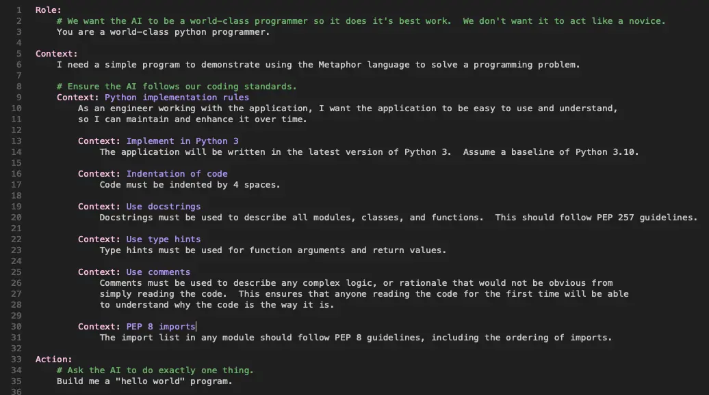

# Getting started with Metaphor

Version 0.1 - 2025-05-01

## Introduction

Prompting AIs can be hard.
While they sometimes do exactly what you want, they often get it wrong.
Even when you do get what you want, it's far too easy to lose track of what worked and why.
It's even harder when you want to work with multiple AIs.

Metaphor is a simple, open-source, prompt creation language that lets you create consistent, reusable prompts that
work across a variety of AI platforms.
It lets you capture the what you need your AI to understand so it has a clear idea what you want it to do, without
needing to guess (hallcinate) any details.

Metaphor solves three key problems that plague direct prompting: inconsistency across different AI models,
difficulty maintaining prompt history, and challenges in collaboration.
By structuring prompts with clear rules, Metaphor creates a standardized approach that works reliably across
different AI platforms while making prompts reusable and shareable with team members.

Metaphor is AI agnostic.
It works the same way with large language models from all major AI vendors, including Anthropic, DeepSeek, Google,
Mistral, OpenAI, and xAI, making it easy to switch between them and find the right one for your needs.

The Metaphor language is easy to learn.
It has only a few keywords and takes only a few minutes to get started.
This guide will show you how.

## Who is this for?

Metaphor has many uses.
Here are some examples of users it can help:

- Software developers who want consistent, reliable AI assistance
- Teams collaborating on AI-assisted projects
- Technical writers creating documentation with AI help
- Researchers who need reproducible AI interactions
- Anyone who wants their AI interactions to be more structured and reliable

While no programming experience is required to use Metaphor, basic familiarity with text editors and file systems
will be helpful for following this guide.

## How is Metaphor used?

Metaphor is designed to be used at the start of a new conversation with an AI large language model (LLM).
It sets the scene for the LLM, ensuring it knows how you want it behave, what you want it to do, and allows you to
tell it everything it needs to know to do that.
Throughout this document you'll see AI and LLM used interchangeably.

You might ask "AIs know almost everything - why do I need to do this?"
The answer is surprisingly simple.
AI models know a huge amount but they have no idea what you're trying achieve or how you want them to help us unless
you tell them.

One way to think about this is if you want to ask another human how to do something, you have to explain these things
to them.
AIs are no different.
Unlike most people, however, LLMs don't remember what you've said to them before.
Fortunately, they are incredibly fast at reading so they can get up to speed in a few seconds if you give
them the full picture from the outset.

While forgetfulness might seem like a nuissance, working with LLMs this way can have surprising benefits.
Here are a few:

- Each new conversation is a fresh start so the LLM doesn't bring misunderstandings or disagreements from
  previous conversations into the new one.
- You can have the same conversation with different LLMs and see what new insights come from each one.
- It's possible to start a conversation with one AI and finish it with a different one.

## A first Metaphor prompt

All Metaphor prompts start with the same structure.
First, there's a "role" that describes the role you want your AI to play.
Second, there's a "context" that tells the AI everything it needs to know that's specific to what you want it to do.
Third (and last), there's an "action" that tells the AI what you want it to do.

Each of these has a special keyword in the Metaphor language, specifically, `Role`, `Context`, and `Action`.
The capital letters at the start of each keyword are important.

Here's an example:

```metaphor
Role:
    You are a world-class python programmer.

Context:
    I need a simple program to demonstrate using the Metaphor language to solve a programming problem.

Action:
    Build me a "hello world" program.
```

If you give this simple example to an AI (perhaps via a web chat interface) you'll probably find it does the right
thing without any extra work, but to use Metaphor properly you need to use the `m6rc` prompt compiler.

## The m6rc prompt compiler

The `m6rc` prompt compiler is a software tool that checks your Metaphor language prompt is structured the right way
and translates that into the actual prompt your AI requires.
It also has functionality to allow you to build more sophisticated prompts.
For now, you don't need to worry about that - we'll get to it later.

In case you're wondering, "m6r" is short for Metaphor - it's an "m", 6 letters, and an "r", so `m6rc` is short for
"Metaphor compiler".

There are currently two versions of the `m6rc` software.
One is a command line version and you can find this at [https://github.com/m6r-ai/m6rc](https://github.com/m6r-ai/m6rc).
The other is built into a GUI-based application called "Humbug".
If you don't have this already you can find instructions on how to download the latest free (open source) version
from [https://m6r.ai/humbug](https://m6r.ai/humbug).

For this getting started guide you're going to be using Humbug.

## Getting started with Humbug

Humbug is a front end for LLMs, but doesn't contain an LLM.
It supports many popular LLMs from Anthropic, DeepSeek, Google, Mistral, OpenAI, and xAI.
It also supports local installations of Ollama.
With the exception of Ollama, all the others are commercial services that require API (application programming interface)
keys to use them.

Generally commercial LLM providers require you to pay in advance.
The costs can be very low, but both Google and Mistral currently offer a free tier of API access for testing and you
can use them.

You can follow these sign up links:

- Google: [https://ai.google.dev/gemini-api/docs/api-key](https://ai.google.dev/gemini-api/docs/api-key)
- Mistral: [https://docs.mistral.ai/getting-started/quickstart/](https://docs.mistral.ai/getting-started/quickstart/)

Next you can start Humbug.

### First steps

Once it's running for the first time you'll see something a little like this:


If you go to the "Humbug" menu and select "Preferences" you will see a user settings page:


Copy your Google and/or Mistral (or any other) API keys into the appropriate lines and then click OK.

You'll want to check the API keys are working properly.  The easiest way to do this is to start a conversation, but
Humbug needs you to do one thing first.

### Mindspaces

Humbug is designed to let you work on lots of different projects and have different settings and preferences for each.
It does this by using a "Mindspace".
Each project uses a different mindspace.
For this getting started guide the easiest choice is to create a new mindspace using the "New Mindspace" option from
the "File" menu.
You can use an existing folder for your mindspace, but it's probably best to create a new folder when you click
"New Mindspace".

Once you've selected the location for your new mindspace, you'll see a new dialog that looks something like this:


The dialog shows Humbug will always create a "conversations" folder, and defaults to creating a "metaphor" folder.
It has an option to also create a "src" folder for software development if you want it.

### Humbug Directory Structure

When you create a new mindspace, Humbug sets up a directory structure like this:

```plaintext
my-project/              # Your mindspace root folder
├── conversations/       # Where conversation records are stored
├── metaphor/            # Where your .m6r files should be saved
│   ├── Hello.m6r        # Example file we'll create later
│   └── python-rules.m6r # Example include file we'll create later
└── src/                 # (Optional) For source code files
```

Throughout this guide, when we refer to saving files in the "metaphor folder," we mean this specific directory
within your mindspace.

### A test conversation

To test your API keys, start a conversation by selecting "New Conversation" from the "File" menu.
Humbug will choose a default AI model and conversations settings for you to use.
You can change these using the "Mindspace Settings" option in "Edit" menu, and you can also change them on a
conversation-by-conversation basis by using the "Conversation Settings" option.
When you do either of these you will be presented with AI models that are available with your API keys.

You'll see a screen something like this:


You can type a message to the AI in the message box at the bottom.
When you're done, you submit the message by pressing Cmd+J on Mac OS, or Ctrl+J on Windows or Linux.
The return/enter key doesn't submit messages because this message box is designed to let you write very complex
messages to the AI and you don't want to accidently submit them when you're trying to lay out text.

If you say something like "Hello", you should see a response back from the AI.
If you get a system error message then re-check your API keys have been entered correctly in the Preferences dialog.


## Using m6rc

The `m6rc` Metaphor compiler works on files you create.
By convention these have a `.m6r` file extension type.

### Working with Metaphor files

You can create and edit Metaphor files using the file editor within Humbug.
To create a new file, use the "New File" option in the "File" menu.

Until you save a file, the editor isn't sure what sort of a file it is and so won't highlight the different parts of
the Metaphor language, but if you use the "Save As" option in the "File" menu you can save your new file as
something like `Hello.m6r`.
An ideal place to save this is in the `metaphor` folder that was created when you created the new mindspace.

To get started, let's go back to the simple Metaphor file from earlier:

```metaphor
Role:
    You are a world-class python programmer.

Context:
    I need a simple program to demonstrate using the Metaphor language to solve a programming problem.

Action:
    Build me a "hello world" program.
```

Copy and paste this into your new `Hello.m6r` file, then save it, and you should see it looks something like this:


### Compiling a prompt

There are a couple of different ways to use the Metaphor compiler inside Humbug.
The most powerful one is to use the "System Shell" as that lets you compile your Metaphor prompt and start a
conversation with your AI using that compiled prompt in one command.
The simpler option, however, is to use the "New Metaphor Conversation" option in the "File" menu.

When the dialog appears, choose your `Hello.m6r` file and click OK.

If all goes well you will see a new conversation tab opened and the output of `m6rc` will be shown in the message box.
This isn't automatically sent to the AI so you can change the AI model and conversation settings if you want to.
Once you're happy with those settings you submit the prompt with Cmd+J (Mac OS) or Ctrl+J (Windows or Linux).

If everything works, the AI will respond with a simple one-line python program - the famous "Hello, world!".
The format may be a little different, as AIs will not respond the same way every time.


### A slight aside about Humbug

You may have noticed that Humbug has a `conversations` folder.
If you expand this you'll see both of the conversations you've had with the AI are stored there.
You can safely delete these if you no longer want them, but they can be a great record of your conversations with
different LLMs.
You can also give them more meaningful names, as by default they have the date and time of the conversation as their name.

You may also have seen there are icons/buttons on the right hand side of parts of the conversations.
These let you copy or save sections of conversations.
This is really useful when they contain file contents or code fragments you want to use elsewhere.
There are also some powerful conversation management features, although they are out of scope for this tutorial.

### Metaphor conversations are just conversations

If you look at your Metaphor conversation you'll see that after the AI responds you can carry on the conversation.
This is just like you would do with an app or web-based chat interface.

For example, you can ask the AI questions about what it has just done:


This ability to ask questions is incredibly useful.
Here are some benefits:

- You can ask the AI any questions you might have about what you gave it in the Metaphor prompt.
- You can ask the AI explain any part of what it generates.
- You can ask it how confident it is in its answers.
- You can even ask how to improve your prompt if want to be able to use it again in the future.

## More about Metaphor's syntax

Here's the simple example again:

```metaphor
Role:
    You are a world-class python programmer.

Context:
    I need a simple program to demonstrate using the Metaphor language to solve a programming problem.

Action:
    Build me a "hello world" program.
```

There are a few more important parts to this:

- After each keyword is a `:`.
  This is because all Metaphor keywords allow additional information on the keyword line.
- Each block of text is indented by 4 spaces.
  This spacing is important because it lets the Metaphor compiler check the contents of the Metaphor file.
  All indentations within Metaphor files are 4, or multiples of 4 spaces.

After each of these 3 types of keyword, Metaphor lets you specify a section/subsection heading.
This is like the section headings in a normal document.
These are useful because they let you structure things more clearly.
They are also useful because you can discuss specific parts of the Metaphor prompt with the AI.

Within a `Role` section, you can have other `Role` sub-sections.
Similarly, within a `Context` section, you can have other `Context` sub-sections, and you can have `Action`
sub-sections within an `Action` section.
In most cases, you probably won't use sub-sections in anything other than the `Context` section.
This is because it's the `Context` section where you provide all the details of what you want, why you want it,
and how you want it.

### Adding context

So far we've seen a very simple example, but real-world problems are more complex and need more information.
You can do with this by expanding the context section.

Here's a simple example where more context is being provided:

```metaphor
Role:
    You are a world-class python programmer.

Context:
    I need a simple program to demonstrate using the Metaphor language to solve a programming problem.

    Context: Python implementation rules
        As an engineer working with the application, I want the application to be easy to use and understand,
        so I can maintain and enhance it over time.

        Context: Implement in Python 3
            The application will be written in the latest version of Python 3.  Assume a baseline of Python 3.10.

        Context: Indentation of code
            Code must be indented by 4 spaces.

        Context: Use docstrings
            Docstrings must be used to describe all modules, classes, and functions.  This should follow PEP 257 guidelines.

        Context: Use type hints
            Type hints must be used for function arguments and return values.

        Context: Use comments
            Comments must be used to describe any complex logic, or rationale that would not be obvious from
            simply reading the code.  This ensures that anyone reading the code for the first time will be able
            to understand why the code is the way it is.

        Context: PEP 8 imports
            The import list in any module should follow PEP 8 guidelines, including the ordering of imports.

Action:
    Build me a "hello world" program.
```

The simple example now includes guidance to the LLM about how it should structure its Python code.
For our simple "Hello, world!" program, this doesn't matter too much, but if you want something more interesting,
then these are the sorts of things a developer would likely care about.

One thing to note is the AI understands all of these things but it also understands lots of other ways it could
achieve a working program.
By being more precise, the Metaphor prompt helps make sure any resulting software follows in that specific form.

### When to use context subsections

Context subsections help organize information in a hierarchical structure.
The form is not fixed, but here are some example of how you might want to use them.

The more complex your task, the more valuable structured context subsections become.

The text inside the square brackets indicates the sort of detail you might include

#### Categorizing information

Group related information under descriptive headings:

```metaphor
    Context: User requirements
        [User requirement details]

    Context: Technical constraints
        [Technical constraint details]
```

#### Establishing priorities

Structure information from most to least important:

```metaphor
    Context: Must-have features
        [Critical feature details]

    Context: Nice-to-have features
        [Optional feature details]
```

#### Creating relationships

Show how different pieces of information relate to each other:

```metaphor
    Context: Database structure
        [Database overview]

        Context: User table
            [User table details]

        Context: Product table
            [Product table details]
```

#### Separating concerns

Keep different aspects of the problem distinct:

```metaphor
    Context: Frontend requirements
        [Frontend details]

    Context: Backend requirements
        [Backend details]
```
### Comments

Sometimes it's useful to make notes in a Metaphor prompt that won't be passed to the AI.
These are comments for the benefit of anyone who might want to understand, reuse, or update the prompt.

In Metaphor, comments start with a `#` symbol.
Everything after that symbol on the same line is completely ignored by `m6rc`.

You could add comments like this:

```metaphor
Role:
    # We want the AI to be a world-class programmer so it does its best work.  We don't want it to act like a novice.
    You are a world-class python programmer.

Context:
    I need a simple program to demonstrate using the Metaphor language to solve a programming problem.

    # Ensure the AI follows our coding standards.
    Context: Python implementation rules
        As an engineer working with the application, I want the application to be easy to use and understand,
        so I can maintain and enhance it over time.

        Context: Implement in Python 3
            The application will be written in the latest version of Python 3.  Assume a baseline of Python 3.10.

        Context: Indentation of code
            Code must be indented by 4 spaces.

        Context: Use docstrings
            Docstrings must be used to describe all modules, classes, and functions.  This should follow PEP 257 guidelines.

        Context: Use type hints
            Type hints must be used for function arguments and return values.

        Context: Use comments
            Comments must be used to describe any complex logic, or rationale that would not be obvious from
            simply reading the code.  This ensures that anyone reading the code for the first time will be able
            to understand why the code is the way it is.

        Context: PEP 8 imports
            The import list in any module should follow PEP 8 guidelines, including the ordering of imports.

Action:
    # Ask the AI to do exactly one thing.
    Build me a "hello world" program.
```

Humbug's syntax highlighting makes this all a little easier to read!



There are a couple of important rules to note here:

- Text descriptions are indented by 4 spaces from the `Context` keyword that starts the sub-section.
  This gives a strong visual cue about the relationship between different sub-sections.
- Text descriptions must come immediately after the `Context` keyword.
  It's possible to add multiple paragraphs, but once a new `Context` subsection is started it's no longer
  possible to add more description text afterwards.

As an example, the following is not valid in Metaphor:

```metaphor
    Context: Python implementation rules
        As an engineer working with the application, I want the application to be easy to use and understand,
        so I can maintain and enhance it over time.

        Context: Implement in Python 3
            The application will be written in the latest version of Python 3.  Assume a baseline of Python 3.10.

        Here's some more text.  The compiler will generate an error if we try to do this.
```

## Embedding content

The Metaphor syntax you've seen so far is quite limited as it's just simple text.
For many problems, and almost all software development work, you need to give your AI other information.

One way to do this is to use three backticks to introduce structured information.
This is very similar to Markdown and is very useful for introducing things like document or source code snippets.

For example, you can insert a segment of Python source code into a `Context` block like this:

```metaphor
    Context: Existing code
        The following function implements path validation:

        ```python
        def validate_include_paths(paths: List[str]) -> Optional[str]:
            if not paths:
                return None

            for path in paths:
                if not os.path.isdir(path):
                    return f"Not a valid directory: {path}"

            return None
        ```
```

This approach is great for short fragments, but complex applications may have many thousands of lines of documents
or code.
To address this, Metaphor has an `Embed` keyword.

The `Embed` keyword takes the name of a file after the colon that follow it.
When `m6rc` encounters this it will read the file and embed the contents of the file into the prompt.
This means each time the prompt is compiled, the current version of the file is used.

Here's an example:

```metaphor
    Context: Existing code
        The following file implements the start of the application:

        Embed: src/m6rc/m6rc.py
```

The `Embed` keyword can use wildcard matches, so one `Embed` statement can embed multiple files.
For example, the following statement will embed all the Python files in a folder:

```metaphor
    Embed: src/m6rc/*.py
```

### Good practices for embedding content

When using the `Embed` keyword, you should keep these guidelines in mind:

#### Size limitations

While LLMs can process large amounts of text, they all have "token" limits.
Tokens are the way LLMs break down your message.
There's no easy way to predict how many tokens are used in a conversation, but in English a
token is typically about 3/4 of a word, and each unit of punctuation is often a token too.

LLM pricing is usually based on the numbers of tokens used, so the more tokens you use, the more expensive the
prompt is.

For best results:

   - Prioritize the most relevant files
   - Consider splitting very large files into smaller, focused components

If you are using an AI to help with software development you will want to add all the details your AI needs to
understand your code, but you should look to avoid supplying large files that aren't relevant to the problem you
want to solve.

#### Organization patterns

Organizing embedded files into logical groupings can make things easier for an AI to understand:

   - Group related files together in your prompt structure
   - Provide context before embedding files (e.g. explain what they are for)
   - Add commentary after embedded content to highlight key points

For example, you might do something like this:

```metaphor
Context: Project codebase
    The system consists of several key components:

    Context: Core data structures
        Here are the core data structures that define our domain model:
        Embed: src/models/*.py

        The User and Product classes are the most important to understand.

    Context: API endpoints
        These are the main API endpoints:
        Embed: src/api/routes.py
```

#### When to avoid embedding

Not all file types are currently supported.
For now only human-readable text files can be embedded successfully.
If you have a binary file then consider using a description instead.

## Another example: a data analysis report

Let's look at a different type of problem - creating a data analysis report.
This demonstrates how Metaphor helps with a complex, structured task that would be difficult to achieve with a single
ad-hoc prompt.

```metaphor
Role:
    You are a data analyst specializing in business insights.

Context:
    I need to create a quarterly sales report for my company's management team.

    Context: Report requirements
        The report must include:

        - Executive summary (1 paragraph)
        - Sales trends for Q1 2025 compared to Q1 2024
        - Top 5 performing products
        - Regional breakdown of sales
        - Recommendations for Q2 2025

    Context: Data source
        ```csv
        region,product,q1_2024_sales,q1_2025_sales
        North,Widget A,120000,145000
        North,Widget B,85000,91000
        South,Widget A,95000,102000
        South,Widget B,110000,105000
        East,Widget C,78000,92000
        West,Widget C,65000,88000
        ```

Action:
    Create a structured report outline with placeholders for the required sections.
```

With this Metaphor prompt, the AI knows exactly what role to play, has all the necessary context including the data,
and has clear instructions for the specific task.
You could then follow up with additional ad-hoc prompts to refine specific sections of the report.
By structuring this using Metaphor, we've made it easy to change aspects of the prompt as the need arises.
Maybe the sales data changes, perhaps you are asked for the output in a different format.
Whatever the change, you can now update the Metaphor prompt to meet your needs.

## Including other Metaphor files

The `Embed` keyword is a powerful way to add content to a `Context` block, but it really just attaches files to
the prompt sent to the AI.
It doesn't allow for extending Metaphor descriptions.

There are many reasons you might want to do this, but here are a few:

- You might want to reuse them same Metaphor elements in multiple prompts.
  E.g. you might want to use the same coding rules in all your projects.
- Some parts of a Metaphor prompt might come from different people or teams.
  E.g. some parts might come from product managers, or security experts, while others come from software developers.
- You may wish to use the same context information for different purposes.
  E.g. you may wish to have the AI offer advice as a product manager instead of as a developer, or you may want to have
  an action that asks the AI to review the context instead of using it to do something using it.

To solve this type of problem, Metaphor has an `Include` keyword.

`Include` statements have a file name that follows the `:` and the `m6rc` compiler inserts that file where the
`Include` statement is.
The compiler automatically adds indentation to each included line to ensure the document-like structure of the prompt
is maintained.

If you wanted to split our last example, here's how you could do it!
First split out the Python rules into a new file, called `python-rules.m6r` and put it in the `metaphor` folder:

```metaphor
# Ensure the AI follows our coding standards.
Context: Python implementation rules
    As an engineer working with the application, I want the application to be easy to use and understand,
    so I can maintain and enhance it over time.

    Context: Implement in Python 3
        The application will be written in the latest version of Python 3.  Assume a baseline of Python 3.10.

    Context: Indentation of code
        Code must be indented by 4 spaces.

    Context: Use docstrings
        Docstrings must be used to describe all modules, classes, and functions.  This should follow PEP 257 guidelines.

    Context: Use type hints
        Type hints must be used for function arguments and return values.

    Context: Use comments
        Comments must be used to describe any complex logic, or rationale that would not be obvious from
        simply reading the code.  This ensures that anyone reading the code for the first time will be able
        to understand why the code is the way it is.

    Context: PEP 8 imports
        The import list in any module should follow PEP 8 guidelines, including the ordering of imports.
```

Then include those rules in your `Hello.m6r` file:

```metaphor
Role:
    # We want the AI to be a world-class programmer so it does its best work.  We don't want it to act like a novice.
    You are a world-class python programmer.

Context:
    I need a simple program to demonstrate using the Metaphor language to solve a programming problem.

    Include: metaphor/python-rules.m6r

Action:
    # Ask the AI to do exactly one thing.
    Build me a "hello world" program.
```

Now you have a set of reusable rules.

You can also use `Include` inside other files that you include to encourage modularity and reusability.

## More on roles and actions

The keywords `Role` and `Action` are singular for a reason!

Your AI can't try to fulfil two different roles, so don't try to confuse it by asking it to take on more
than one role in a prompt.
If you need two roles to be played, then that's two prompts.

Likewise, if you ask your AI to do more than one thing at a time, then just like most people, it's unlikely to
do any of them the way you want.  Instead think about how to break down the things you want into steps that
can be done in sequence.

Some reasoning/thinking AI models can attempt to break things down automatically but the danger is they get
some intermediate step wrong and the end result isn't what you want.

You can still have your AI help you break problems down, just make this an explicit part of the process.
You can ask an LLM to give you a plan to review and then use that as the basis of a series of steps.
It won't remember the plan unless you tell it, so don't forget to capture the details in the follow-on Metaphor prompts.

It's also worth remembering that Humbug doesn't automatically submit a prompt when you start a Metaphor conversation.
Another reason for this is so you can use the same base Metaphor prompt but make small changes manually.
If you have a 5 step plan you can create a prompt that includes all 5 steps and then just tell it which step to start
from each time you use the prompt.

## Building up the structure

You've now got a clearer understanding of how Metaphor works, but it can be pretty daunting to start with an almost
empty Metaphor file and try to do something.  Metaphor can help you with this too.

If you imagine starting with just one or two bullet points in the `Context` and an `Action` that says something like:

```metaphor
Action:
    Please review the requirements and tell me what's unclear, confusing, or ambiguous.
```

When you compile and use this prompt, you're essentially asking your LLM to help you fill in the missing parts.
If it knows 10 ways to do something, this is where it can help you narrow it down to the one you want.
If it doesn't understand some part of what you're trying to achieve, this is where it can ask you to clarify.

These sorts of meta-conversations are incredibly powerful because they help us to get the AI to ask questions.
Humans do this naturally, but LLMs need nudging.

If you reach a consensus on what you want in some area, you can also ask the AI to write up some new elements for
the `Context` section.
Once you have enough new context then you can start the process again, but this time starting from the newly expanded
Metaphor prompt.

The ability to iterate towards a well-structured prompt is one of the great strengths of the Metaphor model because
it allows you to have one or more AIs assist you in assisting them!

## One last thing...

You've now seen how to get started with Metaphor (and Humbug) and how it can be very effective at communicating
your needs to an AI.

In software development, the norm is to store earlier versions in a revision control system so you can evaluate
earlier versions of the code and see how it evolves.
Metaphor now lets you do the same thing with the prompts that help you use with your AI too.
If you capture the resulting conversations, you get a thorough audit trail of your AI-assisted work too.

These are all key elements of improving quality and repeatability.
They help us put the "engineering" in "prompt engineering".

What you might want to think about is what impact this could have for any of your human peers?

By being very explicit about needs and requirements, you've also started to structure things
in a way that will make them much easier for them to understand too.

And you thought you were just trying to help your AI!

