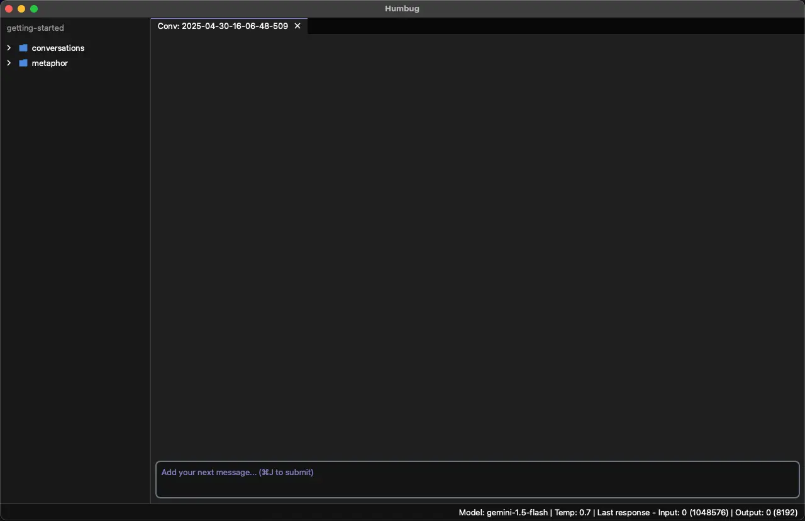

# Getting started with Metaphor

Prompting AIs can be hard.
While they sometimes do exactly what you want, they often get it wrong.
Even when you do get what you want, it's far too easy to lose track of what what worked and why.
It's even harder when you want to work with multiple AIs.

Metaphor is a simple, open-source, prompt creation language that lets you create consistent, reusable prompts that
work across a variety of AI platforms.
It lets you capture the what you need your AI to understand so it has a clear idea what you want it to do, without
needing to guess (hallcinate) any details.

Metaphor is AI agnostic.
It works the same way with large language models from all major AI vendors, including Anthropic, DeepSeek, Google,
Mistral, OpenAI, and xAI, making it easy to switch between them and find the right one for your needs.

The Metaphor language is easy to learn.
It has only a few keywords and takes only a few minutes to get started.
This guide will show you how.

## How is Metaphor used?

Metaphor is designed to be used at the start of a new conversation with an AI large language model (LLM).
It sets the scene for the LLM, ensuring it knows how you want it behave, what you want it to do, and allows you to
tell it everything it needs to know to do that.

You might ask "AIs know almost everything - why do I need to do this?"
The answer is surprisingly simple.
AI models know a huge amount but they have no idea what you're trying achieve or how you want them to help us unless
you tell them.

One way to think about this is if you want to ask another human how to do something, you have to explain these things
to them.
AIs are no different.
Unlike most people, however, LLMs don't remember what you've said to them before.
Fortunately, they are incredibly fast at reading so they can get up to speed in a few seconds if you give
them the full picture from the outset.

While forgetfulness might seem like a nuissance, working with LLMs this way can have surprising benefits.
Here are a few:

- Each new conversation is a fresh start so the LLM doesn't bring misunderstandings or disagreements from
  previous conversations into the new one.
- You can have the same conversation with different LLMs and see what new insights come from each one.
- It's possible to start a conversation with one AI and finish it with a different one.

## A first Metaphor prompt

All Metaphor prompts start with the same structure.
First, there's a "role" that describes the role you want your AI to play.
Second, there's a "context" that tells the AI everything it needs to know that's specific to what you want it to do.
Third (and last), there's an "action" that tells the AI what you want it to do.

Each of these has a special keyword in the Metaphor language, specifically, `Role`, `Context`, and `Action`.
The capital letters at the start of each keyword are important.

Here's an example:

```metaphor
Role:
    You are a world-class python programmer.

Context:
    I need a simple program to demonstrate using the Metaphor language to solve a programming problem.

Action:
    Build me a "hello world" program.
```

If you give this to an AI (perhaps via a web chat interface) you'll probably find it does the right thing without
any extra work, but to use Metaphor properly you need to use a prompt compiler.

## The m6rc prompt compiler

The prompt compiler checks that the Metaphor prompt is structured the right way and allows for more advanced
functionality.  For now, you don't need to worry about other functionality.

What you will need is the right sort of prompt compiler.
This is called `m6rc`, short for "Metaphor compiler".
In case you're wondering, "m6r" is short for Metaphor - it's an "m", 6 letters, and an "r".

There are currently two version of the `m6rc` software.
One is a command line version and you can find this at [https://github.com/m6r-ai/m6rc](https://github.com/m6r-ai/m6rc).
The other is built into a GUI-based application called "Humbug".
If you don't have this already you can find instructions on how to download the latest free (open source) version
from [https://m6r.ai/humbug](https://m6r.ai/humbug).

For this getting started guide you're going to be using Humbug.

## Getting started with Humbug

Humbug is a front end for LLMs, but doesn't contain an LLM.
It supports many popular LLMs from Anthropic, DeepSeek, Google, Mistral, OpenAI, and xAI.
It also supports local installations of Ollama.
With the exception of Ollama, all the others are commercial services that require API (application programming interface)
keys to use them.

Generally commercial LLM providers require you to pay in advance.
The costs can be very low, but both Google and Mistral currently offer a free tier of API access for testing and you
can use them.

You can follow these sign up links:

- Google: [https://ai.google.dev/gemini-api/docs/api-key](https://ai.google.dev/gemini-api/docs/api-key)
- Mistral: [https://docs.mistral.ai/getting-started/quickstart/](https://docs.mistral.ai/getting-started/quickstart/)

Next you can start Humbug.
Once it's running for the first time you'll see something a little like this:


If you go to the "Humbug" menu and select "Preferences" you will see a user settings page:


Copy your Google and/or Mistral (or any other) API keys into the appropriate lines and then click OK.

You'll want to check the API keys are working properly.  The easiest way to do this is to start a conversation, but
Humbug needs you to do one thing first.

Humbug is designed to let you work on lots of different projects and have different settings and preferences for each.
It does this by using a "Mindspace".
Each project uses a different mindspace.
For this getting started guide the easiest choice is to create a new mindspace using the "New Mindspace" option from
the "File" menu.
You can use an existing folder for your mindspace, but it's probably best to create a new folder when you click
"New Mindspace".

Once you've selected the location for your new mindspace, you'll see a new dialog that looks something like this:


The dialog shows Humbug will always create a "conversations" folder, and defaults to creating a "metaphor" folder.
It has an option to also create a "src" folder for software development if you want it.

To test your API keys, start a conversation by selecting "New Conversation" from the "File" menu.
Humbug will choose a default AI model and conversations settings for you to use.
You can change these using the "Mindspace Settings" option in "Edit" menu, and you can also change them on a
conversation-by-conversation basis by usign the "Conversation Settings" option.
When you do either of these you will be presented with AI models that are available with your API keys.

You'll see a screen something like this:



You can type a message to the AI in the message box at the bottom.
When you're done, you submit the message by pressing Cmd+J on MacOS, or Ctrl+J on Windows or Linux.
The return/enter key doesn't submit messages because this message box is designed to let you write very complex
messages to the AI and you don't want to accidently submit them when you're trying to lay out text.

If you say something like "Hello", you should see a response back from the AI.
If you get a system error message then re-check your API keys have been entered correctly in the Preferences dialog.


## To Do:

- syntax
- iterating to a solution
- getting started from nothing
- interactions with other people are easier.
